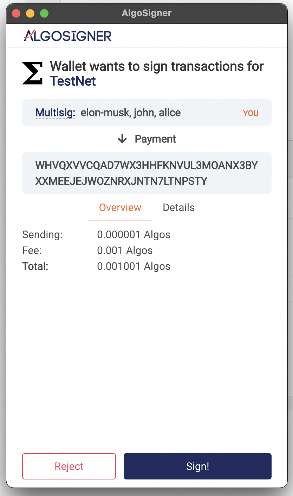

# Algo Builder Web Support for Multisignature Transaction

The purpose of this tutorial is the demonstrate the usage of Algo Builder Web Package to sign and send a Multisignature Transaction to blockchain network using major Algorand wallets (Algo Signer, Wallet Connect, MyAlgoWallet).

### Requirements

- [Algo Builder](https://algobuilder.dev/) and it's [dependencies](https://algobuilder.dev/guide/README#requirements)
- Setup the accounts on [`Algosigner`](https://github.com/PureStake/algosigner), [`Wallet Connect`](https://walletconnect.com/) wallet and [`MyAlgo Wallet`](https://wallet.myalgo.com/). It could be MainNet, TestNet or private net.

## Steps

In this tutorial we will use Algo Builder Wallet Widget to connect to various web wallets. Then we will show how to instrument the wallet to sign a multisignature transaction.
See [Wallet Widget tutorial](https://developer.algorand.org/solutions/vuejs-multi-wallet-widget/) for more details about the widget.

### MultiSignature Transaction

To create a msig transaction, you can follow steps from the offical documentation: [Create Multisignature](https://developer.algorand.org/docs/get-details/accounts/create/#multisignature) and [Transaction](https://developer.algorand.org/docs/sdks/javascript/) to use use it.
Here is a glimpse of creating the multisig transaction:

```js
const mparams = {
	version: 1,
	threshold: 2,
	addrs: [account1.addr, account2.addr, account3.addr],
};

let multsigaddr = algosdk.multisigAddress(mparams);
let msigTxn = algosdk.makePaymentTxnWithSuggestedParamsFromObject({
	from: multsigaddr,
	to: receiver,
	amount: amount,
	note: note,
	suggestedParams: params,
});
```

After creating the transaction, you can sign it using different wallets.

1. AlgoSigner<br/>
   We use `connectAlgoSigner()` method to connect the AlgoSigner wallet. Next, we create an instance of the `WebMode` class by passing `AlgoSigner` and the Chain Name i.e the network name. The `web` instance will allow us to sign and send transactions to the blockchain.

```js
const web = new WebMode(AlgoSigner, CHAIN_NAME);
```

WebMode method `signMsigTxn` expects txn in [`EncodedSignedTransaction`](https://algorand.github.io/js-algorand-sdk/interfaces/EncodedSignedTransaction.html) type. To convert the above created msig transaction, below code is used:

```js
let subsig = [];
for (const address of mparams.addrs) {
	subsig.push({ pk: decodeAddress(address).publicKey });
}
const msigEncodedTxn = {
	msig: { v: mparams.version, thr: mparams.threshold, subsig: subsig },
	txn: msigTxn.get_obj_for_encoding(),
};
```

To sign the msig transaction:

```js
const signedTxnResponse = await web.signMsigTxn([msigEncodedTxn]);
```

The following screen will popup for you to sign the txn:
<br/>


After signing, the response is the object containing blob key, which we can use further to send the signed transaction to the network.
To send the above txn we need to first convert it to base64:

```js
const base64Txn = Buffer.from(signedTxnResponse.blob).toString("base64");
const sendTxnResponse = await webmode.sendAndWait(base64Txn);
```

The sent txn response includes the confirmed transaction response along with txID.

2. MyAlgo Wallet <br/>
   We use `connectMyAlgoWallet()` method to connect to My Algo wallet.

```js
   async connectMyAlgoWallet() {
      try {
        let walletURL = {
          token: "",
          server: "https://node.algoexplorerapi.io",
          port: "",
        }
        let myAlgoMode = new MyAlgoWalletSession(walletURL);
        await myAlgoMode.connectToMyAlgo();
        if (myAlgoMode.accounts.length) {
          this.walletAddress = myAlgoMode.accounts[0].address;
        }
      } catch (e) {
        console.error(e);
      }
   }
```

Algo Wallet method `signTransaction` expects transaction in [algosdk.Transaction](https://algorand.github.io/js-algorand-sdk/classes/Transaction.html) type.

```js
const txn = algosdk.Transaction.from_obj_for_encoding(msigEncodedTxn.txn);
const signedTxnResponse = await myAlgoMode.signTransaction(txn);
```

The following screens will popup for you to login to msig and sign the txn:<br/>


The signed txn response is the object containing blob key.
To send the above txn:

```js
const sendTxnResponse = await algoWallet.sendAndWait(signedTxnResponse.blob);
```

Here also the sent txn response includes the confirmed transaction response along with txID.

3. Wallet Connect<br/>
   Perra Wallet currently doesn't support Multisignature transaction signature, thus it's support will be added after Perra wallet supports it.
