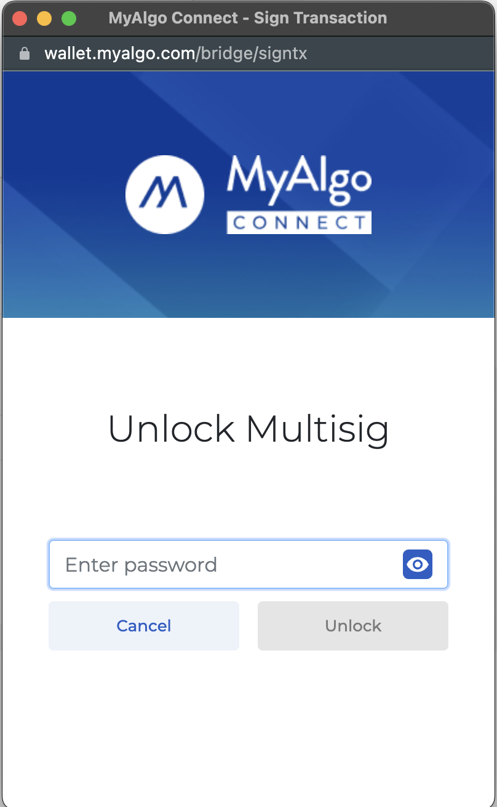
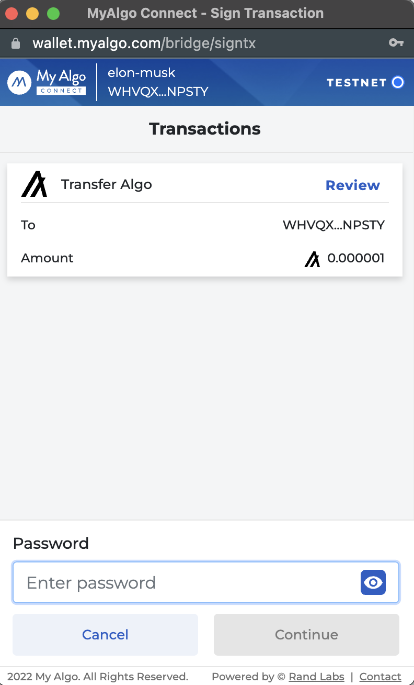
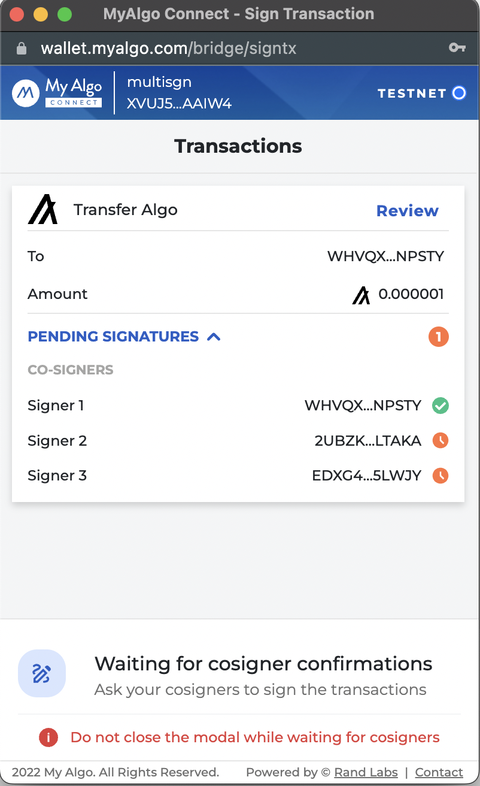

# Algo Builder Web Support for Multisignature Transaction

This tutorial demonstrates the usage of Algo Builder Web Package to sign and send a Multisignature Transaction to blockchain network using major Algorand wallets (Algo Signer, Wallet Connect, MyAlgoWallet).

### Requirements

- [Algo Builder](https://algobuilder.dev/) and it's [dependencies](https://algobuilder.dev/guide/README#requirements)
- Setup the accounts on [`Algosigner`](https://github.com/PureStake/algosigner), [`Wallet Connect`](https://walletconnect.com/) wallet and [`MyAlgo Wallet`](https://wallet.myalgo.com/). It could be MainNet, TestNet or private net.

## Steps

In this tutorial we will use Algo Builder Wallet Widget to connect to various web wallets. Then we will show how to instrument the wallet to sign a multisignature transaction.
See [Wallet Widget tutorial](https://developer.algorand.org/solutions/vuejs-multi-wallet-widget/) for more details about the widget.

### MultiSignature Transaction

To create a msig transaction, you can follow steps from the offical documentation: [Create Multisignature](https://developer.algorand.org/docs/get-details/accounts/create/#multisignature) and [Transaction](https://developer.algorand.org/docs/sdks/javascript/) to use it.
Here is a glimpse of creating the multisig transaction:

```js
const mparams = {
	version: 1,
	threshold: 2,
	addrs: [account1.addr, account2.addr, account3.addr],
};

let multsigaddr = algosdk.multisigAddress(mparams);
let msigTxn = algosdk.makePaymentTxnWithSuggestedParamsFromObject({
	from: multsigaddr,
	to: receiver,
	amount: amount,
	note: note,
	suggestedParams: params,
});
```

After creating the transaction, you can sign it using different wallets.

#### AlgoSigner

We use `connectAlgoSigner()` method to connect the AlgoSigner wallet. Next, we create an instance of the `WebMode` class by passing `AlgoSigner` and the Chain Name i.e the network name. The `web` instance will allow us to sign and send transactions to the blockchain.

```js
const web = new WebMode(AlgoSigner, CHAIN_NAME);
```

WebMode method `signMsigTxn` expects txn in [`EncodedSignedTransaction`](https://algorand.github.io/js-algorand-sdk/interfaces/EncodedSignedTransaction.html) type. To convert the above created msig transaction, `mkMultisigEncodedTx` method is used:

```js
const msigEncodedTxn = tx.mkMultisigEncodedTx(mparams, msigTxn);
```

To sign the msig transaction, make sure to login and sign from the account which is part of the msig transaction, else it will throw an error:

```js
const partialSignedTx = await web.signMsigTx(msigEncodedTxn);
```

The following screen will popup for you to sign the txn:
<br/>


After signing, the response is the object containing blob key which in base64 format, which we can use further to send the signed transaction to other co-signers and also to send it to the network.

For the co-signer to sign the transaction he/she can decode the `partialSignedTx` and sign using:

```js
const decodedPartialSignedTx = algosdk.decodeSignedTransaction(
	Uint8Array.from(Buffer.from(partialSignedTx.blob, "base64"))
);
const signedTxnResponse = await web.signMsigTransaction(decodedPartialSignedTx);
```

To send the signed txn you can use `sendAndWait` method:

```js
const sendTxnResponse = await webmode.sendAndWait(signedTxnResponse.blob);
```

The sent txn response includes the confirmed transaction response along with txID.

#### MyAlgo Wallet

We use `connectMyAlgoWallet()` method to connect to My Algo wallet.

```js
   async connectMyAlgoWallet() {
      try {
        let walletURL = {
          token: "",
          server: "https://node.algoexplorerapi.io",
          port: "",
        }
        let myAlgoMode = new MyAlgoWalletSession(walletURL);
        await myAlgoMode.connectToMyAlgo();
        if (myAlgoMode.accounts.length) {
          this.walletAddress = myAlgoMode.accounts[0].address;
        }
      } catch (e) {
        console.error(e);
      }
   }
```

Algo Wallet method `signTransaction` expects transaction in [algosdk.Transaction](https://algorand.github.io/js-algorand-sdk/classes/Transaction.html) type.

```js
const partialSignedTx = await myAlgoMode.signTransaction(msigTxn);
```

The following screens will popup for you to login to msig and sign the txn:<br/>




The signed txn response is the object containing blob key.

You can send the blob key which in Uint8Array format to co-signer to sign the transaction:

```js
const decodedPartialSignedTx = algosdk.decodeSignedTransaction(partialSignedTx.blob, "base64");
const signedTxnResponse = await myAlgoMode.signTransaction(decodedPartialSignedTx.txn);
```

To send the above txn:

```js
const sendTxnResponse = await algoWallet.sendAndWait(signedTxnResponse.blob);
```

Here also the sent txn response includes the confirmed transaction response along with txID.

#### Wallet Connect

Perra Wallet currently doesn't support Multisig transaction signature, thus it's support will be added after Perra wallet supports it.
