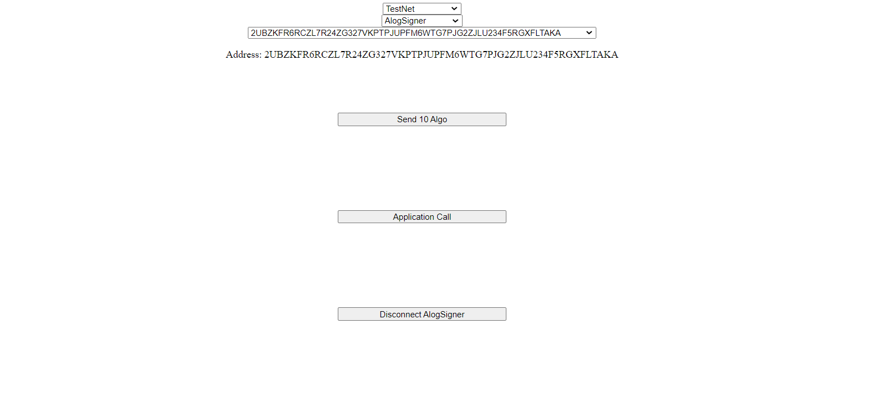
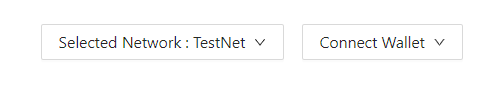
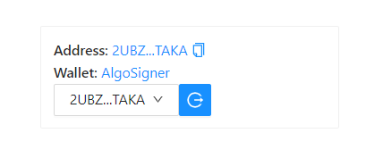

# Algo Builder Wallet Widget

The purpose of this tutorial is a demonstration of the Algo Builder Wallet Widget integrated with the [@algo-builder/web](https://github.com/scale-it/algo-builder/tree/master/packages/web) package, written in Vue JS. The widget connects to major Algorand wallets (Algo Signer, Wallet Connect, MyAlgoWallet), sign and send transactions constructed with Algo SDK or Algo Builder framework.

### Requirements

- [Vue CLI](https://cli.vuejs.org/guide/installation.html)
- [NodeJS](https://nodejs.org/en/download/) > v14.11.0
- JavaScript package manager - either [YARN](https://classic.yarnpkg.com/en/docs/install) > v3.1.0 or NPM which comes with NodeJS.
- IDE, e.g. [VSCode](https://code.visualstudio.com/download).
- Other dependencies are listed in [package.json](https://github.com/scale-it/algo-builder-templates/blob/master/wallet/package.json). Install them with yarn install or npm install.

### Background

Algorand ecosystem lacks a maintained Vue JS component connected to main Algorand web wallets.

[Algo Builder](https://algobuilder.dev/) is one of the major frameworks for smart contract development and integrations. We took a responsibility to provide the community a Vue JS wallet widget, well integrated with the Algo Builder framework and Algo SDK.

In this tutorial we will create a basic Vue JS web application which connects web wallets and perform a simple transaction (for eg: send Algo or call application). With the wallet widget a user can:

- select a network (such as MainNet, TestNet, BetaNet),
- switch an account,
- interact with the web wallet.

### Steps

#### 1. Setup

The source code for this tutorial can be found on GitHub. Start by cloning the repository

    git clone https://github.com/scale-it/algo-builder-templates.git
    cd algo-builder-templates/wallet

The repository contains few interesting templates:
**htlc** : a descriptive example explaining how HTLC contracts work with Algo-Builder.
**monitor-payments**: a nodejs app which monitors payment transactions to a particular address.
**shop**: demonstrates a payment widget connected to different web wallets.
**wallet**: (this tutorial) Algo Builder Wallet Wideget tutorial.
**warcraft**: a descriptive example explaining how to create an escrow account with Algo Builder.

#### 2. Environment Setup

Install all dependencies in your environment:<br/>
` yarn install` or `npm install`

Now, run the app for local development. It will automatically rebuild the app when the code is updated.<br/>
`yarn run dev` or `npm run dev`

App should pop up in your browser, it will look similar to this:


#### 3. Wallet Widget Component

Now you can select your preferred network and connect to a web wallet:


You can now interact with the algorand blockchain (send algos, or call an application):


We present an example of Algo transfer and an application call, with parameters set in `src/constants`.

```ts
export const toAddress = "WK73JQQGCRQCZ5GLQHCXXB6OXIGF6SD22F5P7HPXF5PNH23YUUALUMKOZ4";
export const amount: number = 10e6;
export const applicationId: number = 189;
```

And finally you can disconnect your chosen wallet.

#### 4. Style the Wallet Widget

You can also style your wallet widget using your own custom styles or using an external library by editing the `App.vue` file:

```ts
  <div>
    <select @change="handleNetworkChange">
  	<option :value="0" :key="0">Select a network</option>
  	<option
  	 v-for="option in networkAvailable"
  	 :value="option.value"
  	 :key="option.id"
  	>
  	{{ option.value }}
  	</option>
    </select>
    <div class="header" v-if="walletStore.network">
       <select @change="connectWallet">
  	  <option :value="0" :key="0">Select a wallet</option>
  	  <option
  	   v-for="option in walletsAvailable"
  	   :value="option.value"
  	   :key="option.id"
  	  >
  	  {{ option.value }}
  	  </option>
  	</select>
    </div>
    <div class="header" v-if="currentAddress">
      <select @change="setCurrentAddress">
       <option :value="0" :key="0">Select a account</option>
       <option v-for="addr in walletAddresses" :value="addr" :key="addr">
      	{{ addr }}
       </option>
      </select>
     </div>
  </div>
```

For eg: [Sigma Wallet](https://github.com/scale-it/algobuilder-msig) has a styled wallet widget using [Antd](https://www.antdv.com/) library.



The wallet component above and the whole web page can easily be customized to realize your UX design requirements along with providing the required functionality.
