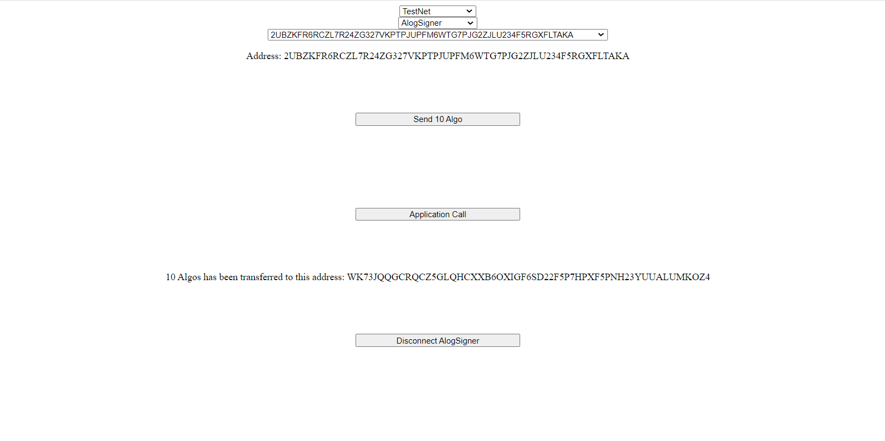

The purpose of the tutorial is a demonstration of Algorand Wallet Widget integrated with the [Algo Builder Web](https://github.com/scale-it/algo-builder/tree/master/packages/web) package, written in Vue JS. The widget connects to major Algorand wallets (Algo Signer, Wallet Connect, MyAlgoWallet), sign and send transactions constructed with Algo SDK or Algo Builder framework.

### Requirements

- [Vue CLI](https://cli.vuejs.org/guide/installation.html)<br/>
- [NodeJS](https://nodejs.org/en/download/) > v14.11.0<br/>
- JavaScript package manager - either [YARN](https://classic.yarnpkg.com/en/docs/install) version > 3.1.0 or NPM which comes with NodeJS.<br/>
- IDE, e.g. [VSCode](https://code.visualstudio.com/download)<br/>
- Other dependencies are listed in [package.json](https://github.com/scale-it/algo-builder-templates/blob/master/wallet/package.json). Install them with yarn install or npm install.<br/>

### Background

Algorand ecosystem lacks a maintained Vue JS component connected to main Algorand web wallets.

[Algo Builder](https://algobuilder.dev/) is one of the main major frameworks for smart contract development and integrations. We took a responsibility to provide the community a Vue JS wallet widget, well integrated with the Algo Builder framework and Algo SDK.

In this tutorial we create a basic Vue jS web application which connects web wallets and perform simple transaction (for eg: send Algo or call application). With the wallet widget a user can:

- select a network (such as MainNet, TestNet, BetaNet),
- switch an account,
- interact with the web wallet.

### Steps

#### 1. Setup

The source code for this tutorial can be found on GitHub. Start by cloning the repository

    git clone https://github.com/scale-it/algo-builder-templates.git
    cd algo-builder-templates/wallet

The repository contains the following templates:<br/>
**htlc** : This is a descriptive example explaining how HTLC contracts work with Algo-Builder.<br/>
**monitor-payments**: This is a nodejs app which monitors payment transactions to a particular address.<br/>
**shop**: This demonstrates the usage of a payment widget to trigger a purchase by connecting to different wallets.<br/>
**wallet**: This helps in connecting to different wallets.<br/>
**warcraft**: This is a descriptive example explaining how Escrow contract work with Algo-Builder.<br/>

#### 2. Environment Setup

Install all dependencies in your environment:<br/>
` yarn install` or `npm install`

Now, run the app for local development. It will automatically update when there are any changes.<br/>
`yarn run dev` or `npm run dev`

After successfully running, your browser screen will look similar to this.


#### 3. Using the Wallet Widget

Now you can select your preferred network and connect to the wallet as per your choice.


You can now interact with the algorand blockchain, by sending algos, or call an application.


You can also update the address to which algos are sent, the algo amount or the application ID by configuring it in `src/constants`.

```ts
export const toAddress = "WK73JQQGCRQCZ5GLQHCXXB6OXIGF6SD22F5P7HPXF5PNH23YUUALUMKOZ4";
export const amount: number = 10e6;
export const applicationId: number = 189;
```

And finally you can disconnect your chosen wallet.

#### 3. Style the Wallet Widget

You can also style your wallet widget with own custom styles or using an external library by editing the `App.vue` file to integrate your styled classes or components.

    ```ts
    <div>
       <select @change="handleNetworkChange">
    		<option :value="0" :key="0">Select a network</option>
    		<option
    			v-for="option in networkAvailable"
    			:value="option.value"
    			:key="option.id"
    		>
    			{{ option.value }}
    		</option>
    	</select>
    	<div class="header" v-if="walletStore.network">
    		<select @change="connectWallet">
    			<option :value="0" :key="0">Select a wallet</option>
    			<option
    				v-for="option in walletsAvailable"
    				:value="option.value"
    				:key="option.id"
    			>
    				{{ option.value }}
    			</option>
    		</select>

    		<div class="header" v-if="currentAddress">
    			<select @change="setCurrentAddress">
    				<option :value="0" :key="0">Select a account</option>
    				<option v-for="addr in walletAddresses" :value="addr" :key="addr">
    					{{ addr }}
    				</option>
    			</select>
            </div>
    	</div>
    </div>

    ```

For eg: [Sigma Wallet](https://github.com/scale-it/algobuilder-msig) has a styled wallet widget using [Antd](https://www.antdv.com/) library.


The wallet component and the whole web page can easily be customized to fulfil your UX design requirements along with providing required functionality.
