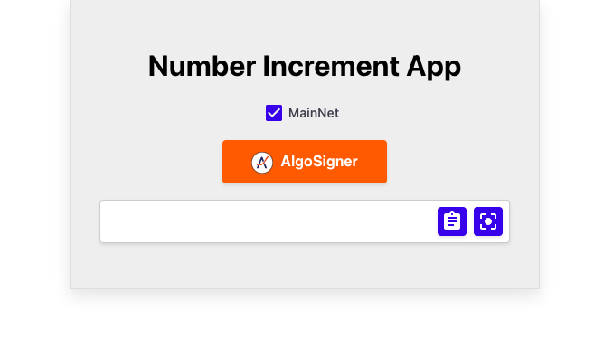

## Objective

This tutorial is to demonstrate [`pipeline-ui`](https://github.com/scale-it/algo-builder-templates/tree/master/pipeline-ui) and [`AlgoSigner`](https://www.purestake.com/technology/algosigner/) in webapp using [`@algo-builder/web`](https://github.com/scale-it/algo-builder/tree/master/packages/web). This is a [React](https://reactjs.org/) + [pipeline-ui](https://www.pipeline-ui.com/) + [WebMode](https://algobuilder.dev/api/web/modules) project which serves as an app template.

## What is `@algo-builder/web`?

`@algo-builder/web` provides `WebMode` class which has variety of high level functions like, [`waitForConfirmation`](https://algobuilder.dev/api/web/classes/WebMode.html#waitForConfirmation), [`executeTx`](<(https://algobuilder.dev/api/web/classes/WebMode.html#executeTransaction)>), [`signTransaction`](<(https://algobuilder.dev/api/web/classes/WebMode.html#signTransaction)>), etc. These functions help sending transactions and building dapps.

## Requirements

- Node 16+
- Clone [`pipeline-ui-template`](https://github.com/scale-it/algo-builder-templates/tree/master/pipeline-ui).
- Yarn `v3.2+` or NPM `v8.0+` or PNPM `v6.21+`.
- Setup the accounts on [`Algosigner`](https://github.com/PureStake/algosigner) wallet. It could be MainNet, TestNet. By default on template it is `MainNet`.

## Steps

1. Setup the [`pipeline-ui-template`](https://github.com/scale-it/algo-builder-templates/tree/master/pipeline-ui)

2. When running the above web app you should be able to access it at [`localhost`](http://localhost:3000/) and you should be able to see below screen. Be default `MainNet` network is selected.



3. Click on the `MainNet` checkbox to choose switch to `TestNet`. Checked checkbox indicates `MainNet` is active else `TestNet` is active.

4. Click on [`Algosigner`](https://github.com/PureStake/algosigner) button to connect to `AlgoSigner` wallet. This will connect only if you have setup the `AlgoSigner` wallet already. On successful connection, your wallet address should display below. It should look simliar to below image.


5. Click on `Deploy` button to deploy the application. This initializes the application. On successful app deployment, you should be able to see something like below. 


6. Click on `Increase Counter` button to call the application. Every succesfull application call increases the counter by one. You should be able to see something like below.


Below method is called on clicking the `Increase Counter` button. Here, we are creating the instance of `WebMode` and then calling it's built-in `executeTx` to call the app.

```ts
appCall = () => {
		const networkType = Pipeline.main
			? NetworkType.MAIN_NET
			: NetworkType.TEST_NET;
		const webMode: WebMode = new WebMode(AlgoSigner, networkType);
		const tx: types.ExecParams[] = [
			{
				type: types.TransactionType.CallApp,
				sign: types.SignType.SecretKey,
				fromAccount: {
					addr: this.props.addr,
					sk: new Uint8Array(0),
				},
				appID: this.props.appId,
				payFlags: {},
			},
		];
		webMode.executeTx(tx);
	};
```

## Summary

In this tutorial we learned how we can connect to [`Algosigner`](https://github.com/PureStake/algosigner) wallet in `React` app using [`pipeline-ui`](https://github.com/scale-it/algo-builder-templates/tree/master/pipeline-ui). We also explored `WebMode` instance to increase the counter by one value and it's in-built method to execute transaction.
